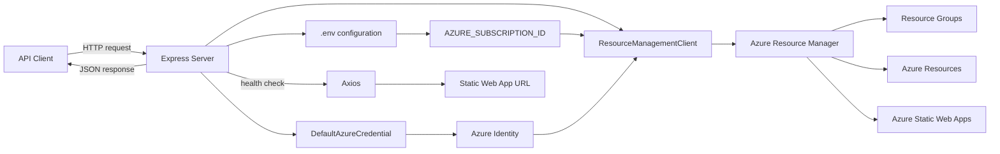

# Azure-Sentinal-MCP

Small Express API for exploring Azure resource groups and Azure Static Web Apps from a configured Azure subscription.

## Architecture



## Requirements

- Node.js
- npm
- Azure credentials available to `DefaultAzureCredential`
- An Azure subscription ID

## Setup

Install dependencies:

```bash
npm install
```

Create a local `.env` file:

```env
AZURE_SUBSCRIPTION_ID=your-subscription-id-here
```

The `.env` file is ignored by Git and should not be committed.

## Run

Start the server:

```bash
npm start
```

The API runs at:

```text
http://localhost:3000
```

## Endpoints

- `GET /resource-groups` - list resource group names
- `GET /resources/:rg` - list resources in a resource group
- `GET /static-webapps/:rg` - list Static Web Apps in a resource group
- `GET /static-webapp-detail/:rg/:name` - get Static Web App details
- `GET /static-webapp-url/:rg/:name` - get the Static Web App URL
- `GET /static-webapp-health/:rg/:name` - check the Static Web App HTTP status

## Authentication

This app uses `DefaultAzureCredential` from `@azure/identity`, so it can authenticate through supported Azure credential sources such as Azure CLI login, managed identity, or environment-based credentials.
